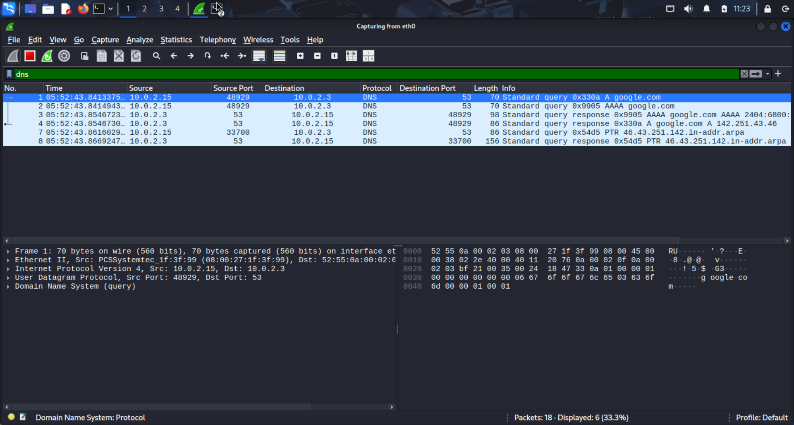
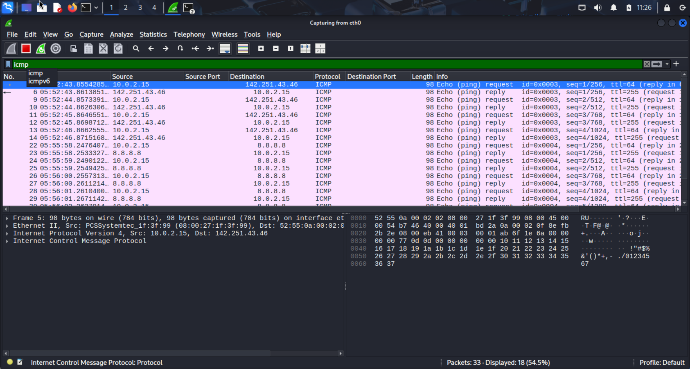
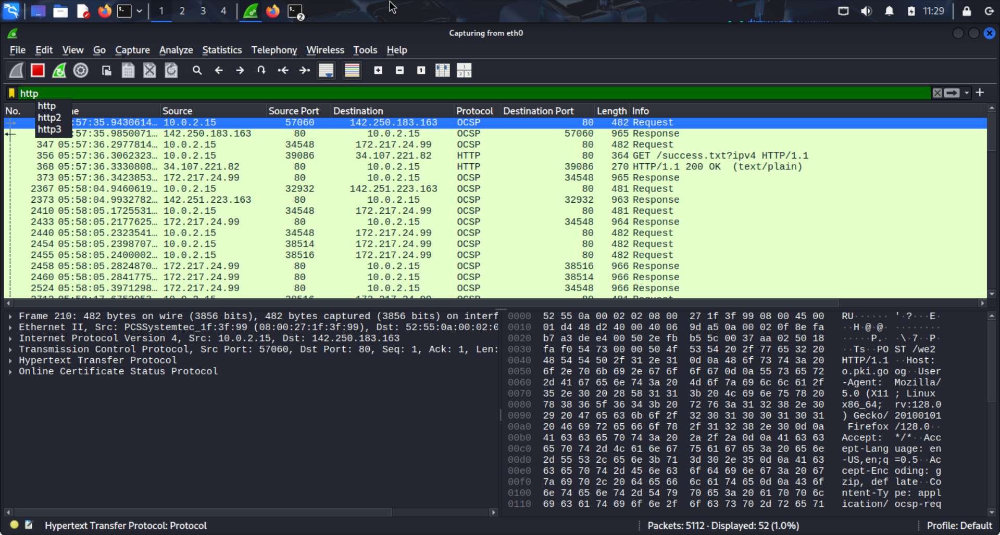
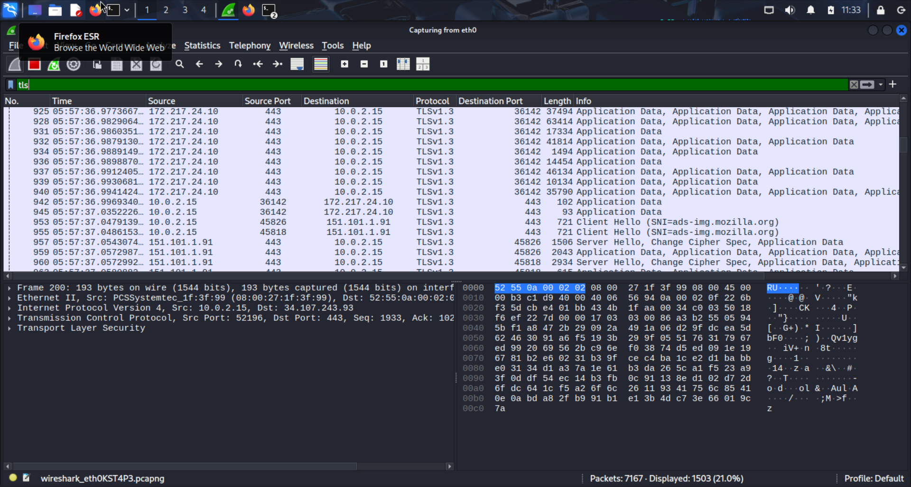
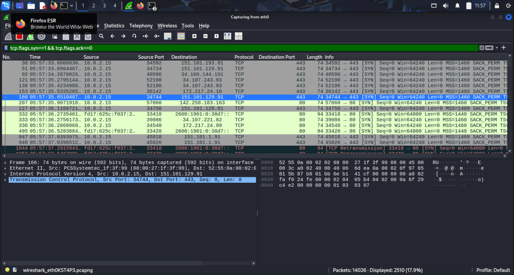

# Network-traffic-analysis-threat-detection
Network traffic analysis and threat detection using Wireshark, including DNS, ICMP, HTTP, HTTPS/TLS, and TCP SYN scan analysis.
# Network Traffic Analysis & Threat Detection Using Wireshark

## Overview

This project demonstrates packet-level network traffic analysis and basic threat detection using Wireshark. Various network protocols were captured, analyzed, and documented to understand network behavior and identify potential security threats.

## Objectives

* Capture and analyze network traffic.
* Understand common protocols used in network communication.
* Identify suspicious network activity through packet inspection.
* Document findings in a structured security report.

## Tools Used

* Kali Linux
* Wireshark
* Nmap

## Traffic Analysis Performed

### DNS Analysis

* Captured DNS queries and responses.
* Observed successful domain name resolution for google.com.
* Identified A and AAAA record lookups.

### ICMP Analysis

* Generated ICMP traffic using ping.
* Analyzed Echo Request and Echo Reply packets.
* Verified successful network connectivity.

### HTTP Analysis

* Captured HTTP GET requests and HTTP responses.
* Observed communication over TCP port 80.
* Demonstrated how HTTP traffic is transmitted in plaintext.

### HTTPS/TLS Analysis

* Captured encrypted HTTPS traffic.
* Observed TLS 1.3 handshake including Client Hello and Server Hello messages.
* Verified secure communication over TCP port 443.

### TCP SYN Packet Analysis

* Generated scanning traffic using Nmap.
* Captured multiple TCP SYN packets in Wireshark.
* Identified behavior consistent with reconnaissance and port scanning activities.

## Key Findings

* DNS successfully resolved domain names to IP addresses.
* ICMP traffic confirmed network connectivity.
* HTTP traffic was visible in plaintext.
* HTTPS traffic was encrypted using TLS.
* SYN packet patterns indicated reconnaissance-style scanning behavior.

## Screenshots

### DNS Analysis

### ICMP Analysis

### HTTP Analysis

### HTTPS/TLS Analysis

### TCP SYN Analysis

## Skills Demonstrated

* Network Traffic Analysis
* Packet Inspection
* Wireshark
* TCP/IP Networking
* DNS Analysis
* HTTP/HTTPS Analysis
* Threat Hunting
* Security Monitoring
* Incident Investigation

## Author

Nabila S

